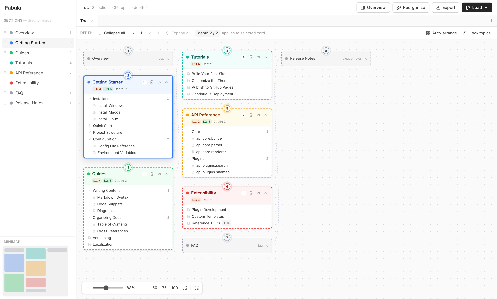

# Fabula

Fabula, a storyboard for your docs' navigation: see it whole, retell
it, re-imagine it.

See your documentation's table of contents the way readers never can —
**as a whole** — and reshape it by dragging, with a lossless round-trip
back to the file your doc system actually reads.



Documentation information architecture lives in TOC files (`toc.yml`,
`mkdocs.yml` and kin) that are edited as text: deeply nested YAML where
"move this subtree under that section" means error-prone cut-and-paste,
and where nobody can see the shape of the whole navigation at once.
Fabula turns that file into cards on an infinite canvas.

## What it does

- **Comprehend** — load a TOC and immediately grasp its structure:
  section sizes, depth, distribution, outliers. Pan, zoom, minimap,
  per-card and global depth controls, per-card YAML view.
- **Restructure** — drag topics (or whole subtrees) within and between
  sections, drag a parent onto the canvas to split it into its own
  section, multi-select and move groups, rename inline, reorder cards.
  Every operation is undoable, and undo is animated so you can see
  exactly what changed back.
- **Compare** — sketch alternative structures in separate tabs
  (duplicate a tab, rearrange, compare) before committing to one.
- **Export** — write the result back to the exact same format,
  losslessly: an unchanged document exports byte-stable, and an edit
  changes only what you touched. Properties the app doesn't understand
  are preserved verbatim.
- **Reorganize with AI (optional)** — bring your own API key (Gemini
  free tier, Claude, or any OpenAI-compatible endpoint). Only topic
  titles are sent — never paths, file names, or file contents — and
  results open as a new tab; the original is never touched.
- **Private by design** — a pure client-side app. No accounts, no
  server, no analytics; your TOC never leaves the browser (the
  optional AI step above — titles only, on your own key — is the
  single exception). Sessions persist locally.

## Supported formats

| Format | Source | Status |
|---|---|---|
| DocFX | `toc.yml` | ✅ |
| MkDocs | `nav:` in `mkdocs.yml` (surrounding config preserved) | ✅ |
| Mintlify | `docs.json` (byte-identical round trip) | ✅ |
| Just the Docs | per-page frontmatter across a docs folder | ✅ |
| Docusaurus (autogenerated sidebar) | directory tree + `_category_.json` | ✅ |
| Hugo | `content/` tree + page front matter, incl. moving pages between sections | ✅ |
| Sphinx | `toctree` directives across files — write-back is **moves-only** | ✅ |
| GitBook, VitePress, mdBook… | | [contributions welcome](CONTRIBUTING.md) |

Single-file formats round-trip through **Export**. Folder-based
systems (Just the Docs, Docusaurus, Hugo, Sphinx) import from a local
folder or a GitHub `/tree/` URL and write back as **reviewed, minimal
per-file edits** — saved straight into the folder (Chromium) or
downloaded as a git-applyable `.patch`. Every plan is verified by
simulation before it can be saved, and files are never deleted.

Saving straight into a folder uses the File System Access API, which
is Chromium-only. In Safari and Firefox, folder import works through
the standard directory picker, and write-back is the downloadable
`.patch` — which works everywhere.

Support for a new system is deliberately a small contribution: **one
adapter file, one fixture, one registry line**, validated by a shared
conformance suite. See [CONTRIBUTING.md](CONTRIBUTING.md).

## Running locally

```sh
pnpm install
pnpm dev        # http://localhost:5173
```

Node ≥ 22, pnpm ≥ 10. `pnpm test` runs the unit/property/conformance
suites; `pnpm e2e` runs the Playwright flows.

## Architecture, briefly

TypeScript + React + Zustand. Every mutation is a **command** executed
through Immer's `produceWithPatches`, so undo/redo are derived inverse
patches — never hand-written. Format knowledge lives entirely in
adapters behind a small interface; the core never sees a YAML dialect.
Property-based tests (fast-check) hold the load-bearing invariant: any
command sequence, undone completely, restores the document byte-for-byte
on export.

The design docs in [`docs/`](docs/) cover the full story — vision,
requirements, architecture, the adapter contract, interaction and
animation rules, testing strategy, and the lessons the design
refuses to relearn.

## License

[AGPL-3.0](LICENSE). If you host a modified Fabula, you must offer
its source to your users.
